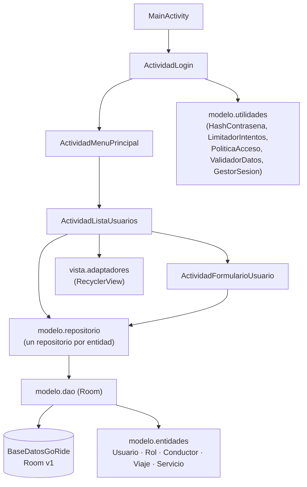

<div align="center">
  
  <h1>ViajaYa</h1>
  <p><b>Base de una app Android (Java) estilo Yango/Uber: inicio de sesión, gestión de usuarios y calculadora de tarifas. Viajes y conductores aún no.</b></p>
  
  
  
  
  
  <p>
    <a href="#-inicio-rápido">Inicio rápido</a> ·
    <a href="#-características">Características</a> ·
    <a href="#-arquitectura">Arquitectura</a> ·
    <a href="#-pruebas">Pruebas</a> ·
    <a href="#-lo-que-todavía-no-existe">Limitaciones</a>
  </p>
</div>

ViajaYa es una aplicación Android académica en Java, organizada en Modelo-Vista-Controlador y con
persistencia local en Room (SQLite). El paquete interno se llama `com.example.goride`. **Hoy no permite
pedir viajes ni asigna conductores**: lo que funciona es el login, un menú y el CRUD de usuarios para el
administrador, más una calculadora de tarifas que todavía no tiene pantalla. La rama por defecto es `master`.

## 🎬 Vista rápida

No se pudo ejecutar la app en un emulador para este README, así que no hay capturas. Este es el flujo real que
existe hoy:

```text
Abrir app ──► Login (usuario + PIN de 4 dígitos)
                 │  5 intentos fallidos ► bloqueo de 60 s (en memoria)
                 ▼
          Menú principal ──► Usuarios (solo Administrador): listar · crear · editar · eliminar
                 │            Roles / Conductores / Viajes / Servicios: botones vacíos (TODO)
                 └──► Cerrar sesión
```

## ✨ Características

| Característica | Detalle |
|:---|:---|
| Inicio de sesión | Usuario + PIN de 4 dígitos; rechaza cuentas con estado `Inactivo` |
| Seguridad del PIN | Se guarda como hash PBKDF2WithHmacSHA1 con sal aleatoria (`HashContrasena`) |
| Bloqueo por intentos | 5 fallos ► 60 s de bloqueo (`LimitadorIntentos`); el contador vive en memoria y se pierde al cerrar la app |
| Sesión | Persistida en SharedPreferences (`GestorSesion`), con cierre de sesión |
| Gestión de usuarios | Listar, crear, editar y eliminar (con confirmación); solo rol Administrador (`PoliticaAcceso`) |
| Validación | Usuario, PIN, correo y teléfono; unicidad de usuario y correo (`ValidadorDatos`) |
| Calculadora de tarifas | `base + km × precio_por_km`, sin negativos ni NaN (`CalculadoraTarifa`); **ninguna pantalla la usa todavía** |
| Datos iniciales | Al primer arranque siembra 3 roles, 5 usuarios de demostración, 4 servicios, 2 conductores y 4 viajes (`InicializadorDatos`) |

## 🏗️ Arquitectura



Roles, conductores, viajes y servicios existen como entidad, DAO, repositorio y adaptador, pero sin pantalla.

<details>
<summary>Estructura de carpetas</summary>

```text
app/src/main/java/com/example/goride/
├── controlador/       Activities: login, menú, usuarios (lista y formulario)
├── modelo/
│   ├── entidades/     Entidades Room
│   ├── dao/           Interfaces Room
│   ├── repositorio/   Fachada sobre cada DAO
│   ├── basedatos/     BaseDatosGoRide (versión 1)
│   └── utilidades/    Hash, límite de intentos, política de acceso, validación, tarifa, sesión, datos iniciales
└── vista/adaptadores/ Adaptadores de RecyclerView
app/src/main/res/layout/  Vistas XML
docs/CREDENCIALES.md      Usuarios de demostración
```

</details>

## 🚀 Inicio rápido

| Requisito | Versión |
|:---|:---|
| JDK | 17 (el que usa el CI) |
| Android SDK | Plataforma 34 (Android Studio la instala) |
| Gradle / AGP | Wrapper incluido: Gradle 8.9, AGP 8.7.3 |
| Dispositivo | Emulador o teléfono con Android 7.0+ (minSdk 24) |

1. Clona y entra (la rama por defecto es `master`):
   ```bash
   git clone https://github.com/Luiss2080/ViajaYa.git
   cd ViajaYa
   ```
2. Indica dónde está el SDK (o crea `local.properties` con `sdk.dir=...`):
   ```bash
   export ANDROID_HOME=/ruta/al/Android/Sdk
   ```
3. Compila el APK de depuración y ejecútalo en un emulador o abriendo el proyecto en Android Studio:
   ```bash
   ./gradlew assembleDebug
   ```

Los usuarios de demostración están en [`docs/CREDENCIALES.md`](docs/CREDENCIALES.md). No hay un flujo de primer
arranque para crear tu propio administrador.

## 🧪 Pruebas

```bash
./gradlew test
```

Hay **27 pruebas unitarias JVM** (JUnit 4) más `ExampleUnitTest`, la plantilla por defecto de Android Studio. El
conteo sale de las anotaciones `@Test` en `app/src/test`; no pude ejecutarlas localmente (no hay Android SDK en
esta máquina), pero el CI corre `./gradlew test` y `./gradlew assembleDebug` con JDK 17 en cada push a `master` o
`main` y en pull requests. Cubren: hash de contraseñas (9), calculadora de tarifas (6), limitador de intentos (5),
validadores (5) y política de acceso (2). Las pruebas instrumentadas (`androidTest`) son solo la plantilla, y no
hay pruebas de interfaz ni de los DAO.

## 🔒 Seguridad

- Consultas Room con parámetros enlazados: no hay SQL concatenado.
- Las Activities comprueban sesión y rol al abrirse; no dependen solo de ocultar botones.
- Límite de intentos de login y hash PBKDF2 con sal (60 000 iteraciones, elegido por compatibilidad con API 24).
- Límites conocidos: el PIN de 4 dígitos es una credencial débil por diseño y los usuarios sembrados son de
  demostración (cámbialos antes de cualquier uso real).

## 🚧 Lo que todavía no existe

- Pedir viajes, asignar conductores, mapas, pagos o conexión a internet.
- Pantallas de roles, conductores, viajes y servicios (los botones del menú son `TODO`).
- Máquina de estados de viajes: `Viaje.estado` es texto libre.
- Búsqueda y filtros en los listados.
- Las consultas Room corren en el hilo principal (`allowMainThreadQueries`).
- Base en versión 1, sin migraciones ni esquema exportado.
- Un administrador puede desactivarse o cambiarse el rol a sí mismo desde el formulario.
- Pruebas de interfaz y de DAO.

## 📄 Licencia

Sin licencia definida: todos los derechos reservados por defecto. No se concede permiso de uso, copia ni
distribución.

<div align="center"><sub>Hecho por Luiss2080 · Android, Java y Room</sub></div>
